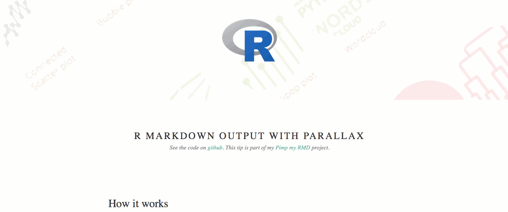
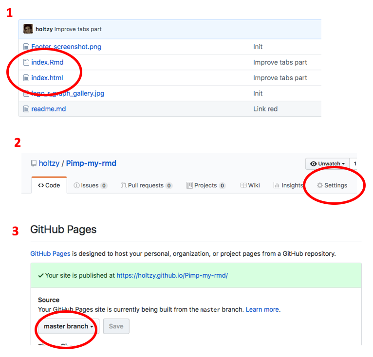

<style>
#TOC {
  top: 1%;
  opacity: 0.5;
}
#TOC:hover {
  opacity: 1;
}
</style>

```{r setup, include=FALSE}
knitr::opts_chunk$set(echo = TRUE)
library(epuRate)
library(rmarkdown)
```
  
<br><br>

> [R markdown](https://rmarkdown.rstudio.com) creates interactive reports from [R](https://www.r-project.org) code. This post provides a few tips I use on a daily basis to improve the appearance of output documents. In any case, an unavoidable resource is the [Rstudio documentation](https://rmarkdown.rstudio.com/html_document_format.html).


# Text formating {#text-formatting}
***
R markdown allows to easily format your text. You can add [links](www.r-graph-gallery.com), write in **bold** or *italic*. This is very well explained in the [Rstudio cheatsheet](https://www.rstudio.com/wp-content/uploads/2015/02/rmarkdown-cheatsheet.pdf).

Here is the code I used to make this paragraph:
```{r, eval=FALSE}
R markdown allows to easily format your text. You can add [links](www.r-graph-gallery.com), write in **bold** or *italic*. This is very well explained in the [Rstudio cheatsheet](https://www.rstudio.com/wp-content/uploads/2015/02/rmarkdown-cheatsheet.pdf).
```


# Horizontal lines {#horizontal-line}
***
Add an horizontal line by adding 3 stars:
```{r, eval=FALSE}
***
```

***


# Chapter auto numbering {#auto-numbering}
***
Header of level 1, 2, 3 are set using #, ## and ###. You can auto number your chapters using this option in the header:
```{r, eval=FALSE}
---
title: "Your title"
output: 
  html_document:
    number_sections: TRUE
---

# Title
## A subtitle
## Another subtitle

# Another title
```


# Skip a line {#skip-line}
***
I really like to add spaces in my document to give it a more uncluttered look. This is done using the `<br>` command. This `.rmd` code:
```{r, eval=FALSE}
A first sentence
<br><br><br><br>
A seconde sentence
```

will give this `html`output:

***

A first sentence
<br><br><br><br>
A seconde sentence

***


# Center an image {#center-image}
***
To center an image, use this code:
```{r eval=FALSE}
<center>

</center>
```

Here is the result
<center>

</center>


# White space around img
***
If you're struggling with to much white space around your image, try to play with the `fig.asp` argument. Here I used `fig.asp=0.50`.
```{r fig.width=3,fig.height=3,fig.align='center',cache=TRUE,fig.cap="Lovely Kangaroo from the Mornington Peninsula.",fig.asp=0.50}
library(png)
library(grid)
img <- readPNG("kan.png")
grid.raster(img)
```
Note: thanks to [Anna Quaglieri](https://twitter.com/annaquagli) for this suggestion.


# Footer and header {#add-footer}
***
You can add some html code at the beginning or at the end of your document. Here is the html code I've added at the end of this document:

```{r, eval=FALSE}
&nbsp;
<hr />
<p style="text-align: center;">A work by <a href="https://github.com/holtzy/">Yan Holtz</a></p>
<p style="text-align: center;"><span style="color: #808080;"><em>Yan.holtz.data@gmail.com</em></span></p>

<!-- Add icon library -->
<link rel="stylesheet" href="https://cdnjs.cloudflare.com/ajax/libs/font-awesome/4.7.0/css/font-awesome.min.css">

<!-- Add font awesome icons -->
<p style="text-align: center;">
	<a href="https://twitter.com/r_graph_gallery?lang=en" class="fa fa-twitter"></a>
	<a href="https://www.linkedin.com/in/yan-holtz-2477534a/" class="fa fa-linkedin"></a>
	<a href="https://github.com/holtzy/" class="fa fa-github"></a>
</p>

&nbsp;
```

Put it in a `footer.html` file that you save in the folder of your `.rmd` file. Then ask to put it at the end of the document in the YAML header:
```{r, eval=FALSE}
---
title: "Your title"
output: 
  html_document:
    includes:
      after_body: footer.html
---
```

Your footer should now look like this:
<center>

</center>


# Space before title {#add-space}
***
I find it pleasant to have a bit of space before starting a new chapter. You can use a `<br>` before each header. A more convenient way is to add some margin in your CSS. Create a `style.css` file:
```{r, eval=FALSE}
h1, .h1, h2, .h2, h3, .h3 {
    margin-top: 84px;
}
```

A `rmd` document that takes into account this `.css` file:
```{r, eval=FALSE}
---
title: "A document with a CSS included"
output:
  html_document:
    css: style.css
---

A title will follow, but with a lot of space before it

# Title 1

content of part 1

# Title 2

content of part 2
```

The document you are reading uses this `css`. See the separation between chapters.


# Figures caption {#add-caption}
***
Specify the caption of your figure in the chunk header. Example:
```{r, eval=FALSE}
{r, fig.align="center", fig.width=6, fig.height=6, fig.cap="Figure: Here is a really important caption."}
```

```{r, message=FALSE, warning=FALSE, fig.align="center", fig.width=6, fig.height=6, fig.cap="Figure: Here is a really important caption."}
library(tidyverse)
mpg %>%
  ggplot( aes(x=reorder(class, hwy), y=hwy, fill=class)) + 
    geom_boxplot() +
    xlab("class") +
    theme(legend.position="none")
```


# Custom caption {#custom-caption}
***
Change the black default caption using CSS. Adding this code in your `style.css` file. 
```{r, eval=FALSE}
<style>
p.caption {
  font-size: 0.9em;
  font-style: italic;
  color: grey;
  margin-right: 10%;
  margin-left: 10%;  
  text-align: justify;
}
</style>
```

file will give this result:
<style>
div.custom_caption { font-size: 0.9em; font-style: italic; color: grey; margin-right: 10%; margin-left: 10%; text-align: justify;}
</style>
<div class = "custom_caption">
```{r, echo=FALSE, message=FALSE, warning=FALSE, fig.align="center", fig.width=6, fig.height=6, fig.cap="Figure: Here is a really important caption, customized to be grey and in italic."}
mpg %>%
  ggplot( aes(x=reorder(class, hwy), y=hwy, fill=class)) + 
    geom_boxplot() +
    xlab("class") +
    theme(legend.position="none")
```
</div>


# Equations {#insert-equation}
***
Insert equation using Latex formating:

$A = (\pi * \lambda \times r^{4}) / \alpha$

Delimit Latex syntax with `$`
```{r, eval=FALSE}
$A = (\pi * \lambda \times r^{4}) / \alpha $
```


# 2 figures in 2 columns {#columns2}
***
You can display 2 plots one beside each other. Add `out.width=c('50%', '50%'), fig.show='hold'` to your chunk header. Something like:

```{r, eval=FALSE}
``{r out.width=c('50%', '50%'), fig.show='hold'}
boxplot(1:10)
plot(rnorm(10))
`
```

```{r out.width=c('50%', '50%'), fig.show='hold', echo=FALSE}
boxplot(1:10)
plot(rnorm(10))
```


# Several columns {#columnsection}
***


<div class = "row">
<div class = "col-md-4">
<br><br>Since R Markdown use the [bootstrap framework](https://getbootstrap.com/docs/4.0/layout/grid/) under the hood. It is possible to benefit its powerful grid system. Basically, you can consider that your row is divided in 12 subunits of same width. You can then choose to use only a few of this subunits.
</div>
<div class = "col-md-4">
<br><br>Here, I use 3 subunits of size 4 (4x3=12). The last column is used for a plot. You can read more about the grid system [here](bootstrap grid system). I got this result showing the following code in my R Markdown document.
</div>
<div class = "col-md-4">
```{r, message=FALSE, echo=FALSE}
ggplot( mtcars, aes(x=mpg)) + geom_histogram(fill="skyblue", alpha=0.5) + theme_minimal()
```
</div>
</div>


 
 
Code to get this result:
```{r, eval=FALSE}
<div class = "row">
  
<div class = "col-md-4">
<br><br>Since R Markdown use the [bootstrap framework](https://getbootstrap.com/docs/4.0/layout/grid/) under the hood. It is possible to benefit its powerful grid system. Basically, you can consider that your row is divided in 12 subunits of same width. You can then choose to use only a few of this subunits.
</div>
  
<div class = "col-md-4">
<br><br>Here, I use 3 subunits of size 4 (4x3=12). The last column is used for a plot. You can read more about the grid system [here](bootstrap grid system). I got this result showing the following code in my R Markdown document.
</div>
  
<div class = "col-md-4">
``{r, message=FALSE, echo=FALSE}
ggplot( mtcars, aes(x=mpg)) + geom_histogram(fill="skyblue", alpha=0.5) + theme_minimal()
``
</div>
</div>
```


# Tabs for sub-chapters {#buttons .tabset .tabset-fade .tabset-pills}
***
Save space in your document using buttons or tabs for sub chapters. Result can look like this:

## First
content of sub-chapter #1

<br><br>

***

Here is the code used to create this section:
```{r, eval=FALSE}
# Use buttons or tabs for sub-chapters {.tabset .tabset-fade .tabset-pills}
***
Save space in your document using buttons or tabs for sub chapters. Add this code at the end of your title:

## First
A first section

## Second
content of sub-chapter #2

## Third
content of sub-chapter #3
```


Note that I've also custom the buttons using this CSS:
```{r, eval=FALSE}
.btn {
    border-width: 0 0px 0px 0px;
    font-weight: normal;
    text-transform: ;
}
.btn-default {
    color: #2ecc71;
    background-color: #ffffff;
    border-color: #ffffff;
}
```

## Second
content of sub-chapter #2

## Third
content of sub-chapter #3


# Use DT for tables {#DT}
***
The [DT library](https://rstudio.github.io/DT/) is my favourite option to display tables in your document. It allows to:

- Show only a few line
- Have a clean appearance
- Have a research bar to find a specific entry
- Add filters to each column
- And much more

Here is an example with the options I use most of the time:
```{r, warning=FALSE}
library(DT)
datatable(mtcars, rownames = FALSE, filter="top", options = list(pageLength = 5, scrollX=T) )
```


# Hide code {#hide-code}
***
If you share your code with somebody who's more focus on results than code, or if your code chunks are very long, you probably want to hide the code, but still allow the reader to consult it if necessary. This is possible by modifying the YAML header of your document:
```{r, eval=FALSE}
output:
  html_document:
    code_folding: "hide"
```

Your code chunks will be hidden in the output, but a small 'code' button will be available to display it if necessary.


# Highlight a piece of text {#highlight}
***
You can apply some `css` to a specific part of your document. Here is an example where I change the background color of a small part. Handy to highlight conclusions at the end of your document.

Code:
```{r, eval=FALSE}
<style>
div.blue { background-color:#e6f0ff; border-radius: 5px; padding: 20px;}
</style>
<div class = "blue">

- This is my first conclusion
- This is my second conclusion

</div>
```

Will give:
<br>
<style>
div.blue { background-color:#e6f0ff; border-radius: 5px; padding: 20px;}
</style>
<div class = "blue">

- This is my first conclusion
- This is my second conclusion

</div>


# Parallax {#parallax}
***
Since R Markdown can output an html document, it is possible to apply whatever techniques used in common website. It is thus possible to set a header with a background image in parallax. See an [example online here](https://holtzy.github.io/R-Markdown-Parallax/). Here is a glimpse of how it looks like:



You need to custom the `css` and the `header.html` files of your document. See the code provided in the [corresponding github repository](https://github.com/holtzy/R-Markdown-Parallax).


# Cache code {#cache}
***
It is possible to cache a specific chunk adding `cache=TRUE` in its header. You can also cash the whole document adding `knitr::opts_chunk$set(cache=TRUE)` in a chunk at the begining of the document.  
<br>
Use this option with care, I strongly advise to read [this document](https://yihui.name/knitr/demo/cache/) by Yihui Xie on this topic.


# Github link in corner {#github-link}
***
Several solutions exist. I used the code provided in [this repo](https://github.com/tholman/github-corners). Made by [Tim Holman](http://tholman.com). Just paste the provided code in your `header.html`, like you have done to add a footer.

<br>
For example [this is the code I used](https://raw.githubusercontent.com/holtzy/epuRate/master/inst/rmarkdown/templates/epurate/resources/header.html) for this document, and the results looks like that:


# Internal link {#link}
***
You can use internal links in R Markdown using anchors. For example, [this link](#github-link) will bring you to the previous chapter. To do it:

- 1 - Put an 'anchor' next to a title. This is how the previous section title looks like:
```{r, eval=FALSE}
# Add a github link in the corner of your document {#github-link}
```

- 2 - Put a link toward this anchor:
```{r, eval=FALSE}
For example, [this link](#github-link) will bring ...
```


# Hyperlink to a section {#Anchor-URL-link} 
***
The anchor described in the previous section can be called directly in the URL. This URL will bring you directly to this section:
```{r, eval=FALSE}
https://holtzy.github.io/Pimp-my-rmd/#Anchor-URL-link
```


# Interactive graphics {#interactive}
***
R allows to build any type of [interactive graphic](https://www.r-graph-gallery.com/interactive-charts/). My favourite library is [plotly](https://www.r-graph-gallery.com/get-the-best-from-ggplotly/) that will turn any of your ggplot2 graphic interactive in one supplementary line of code. Try to hover points, to select a zone, to click on the legend.
<br><br>
```{r, message=FALSE, warning=FALSE, fig.align="center"}
library(ggplot2)
library(plotly)
library(gapminder)
 
p <- gapminder %>%
  filter(year==1977) %>%
  ggplot( aes(gdpPercap, lifeExp, size = pop, color=continent)) +
  geom_point() +
  scale_x_log10() +
  theme_bw()
 
ggplotly(p)
```


# Theme {#theme}
***
You can use any of the [bootswatch theme](https://bootswatch.com) to automatically custom the font and general appearance of your document. You can also control the syntax highlighting style. See the possibilty here. Here is how to call these options in the YAML header:
```{r, eval=FALSE}
title: "your title"
output:
  html_document:
    theme: sandstone
    highlight: tango
```


# Template {#template}
***
Customize the document appearance using a template. Two packages offer several templates:

- [prettydoc](http://yixuan.cos.name/prettydoc/) by [Yixuan Qiu](https://github.com/yixuan)
- [rmdformats](https://github.com/juba/rmdformats) by [Julien Barnier](https://twitter.com/lapply). It provides several templates, like `readthedown`:

<br>

<center>

</center>


# Share it online {#online}
***
Display your html online using [github](https://github.com). Follow these steps:

- You need a [github account](https://github.com/join).
- Name your `.rmd` file `index.rmd`. Knit it to have a `index.html` file.
- Create a repository on github with your working folder.
- On your github online repo go to *Settings* -> *GitHub Pages* -> *Source* -> *Master Branch* -> *Save*.
- Wait a little, your `.html` file will be available at [username.github.io/repoName]()

An attempt to illustrate it with a few screenshots:

<center>

</center>


# Compile in a website {#website}
***
Explanation in the [R Markdown Websites](https://rmarkdown.rstudio.com/rmarkdown_websites.html) section of the R Markdown documentation. Note that this website is render using this technic. To run a basic example:

- fork / download [this github repository](https://github.com/rstudio/rmarkdown-website-examples/tree/master/hello-website) locally.
- Open R
- load the rmarkdown library:
```{r, eval=FALSE}
library(rmarkdown)
```
- build the website doing
```{r, eval=FALSE}
rmarkdown::render_site()
```
- You now have a `_site` folder that contains an `index.html` file. Open it, it is your website. You can host it on github like explained above.

Note that you can go further using the [blogdown package](https://github.com/rstudio/blogdown) to generate static websites based on R Markdown and [Hugo](https://gohugo.io). This allows to build awesome websites only with R. It is used by a huge number of R blogs now.


# Create template {#template-creation}
***
If you often use the same kind of customization you probably want to create your own `.rmd template`. A good starting point is the [Rstudio documentation](https://rmarkdown.rstudio.com/developer_document_templates.html). 

This document is produced using my personal template: [epuRate](https://github.com/holtzy/epuRate). I just custom a bit the CSS, added an header and a footer, and created a skeleton with tips I often use. An easy solution to create your template can be to fork / download this repo and apply your own style instead of mine.


# Session info {#session}
***
It is a good practice to add a session info at the end of your document. It will increase reproducibility and costs only one line of code
```{r}
sessionInfo()
```


# References
***

- The [R Markdown website](https://rmarkdown.rstudio.com)
- [Yihui website](https://yihui.name/knitr/) (author of knitr)


# Feedback
***
This document provides a few tips I often use in my documents. I hope it can help. If you know any other tip I should add, please send me an email to **yan.holtz.data@gmail.com**, or suggest it via the [associated github repository](https://github.com/holtzy/Pimp-my-rmd).

This page is linked with [the R graph gallery](www.r-graph-gallery.com) and you can also reach me on [twitter](https://twitter.com/r_graph_gallery?lang=en)! 


